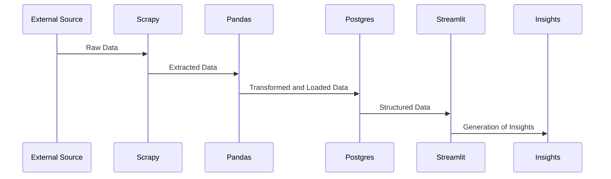

# Architectures

## ETL Flow

Simplified sequence diagram flow

```mermaid
sequenceDiagram
    participant External Source
    participant Scrapy
    participant Pandas
    participant Postgres
    participant Streamlit
    participant Insights

    External Source->>Scrapy: Raw Data
    Scrapy->>Pandas: Extracted Data
    Pandas->>Postgres: Transformed and Loaded Data
    Postgres->>Streamlit: Structured Data
    Streamlit->>Insights: Generation of Insights
```